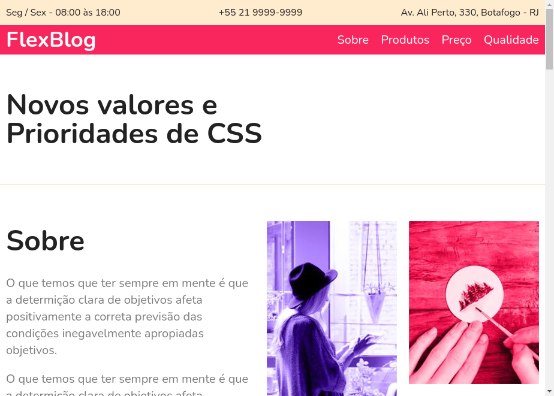

# FlexBlog
> Curso da Origamid 

representação do projeto

[🔗Clique aqui para acessar](https://atilacsilva.github.io/flexblog) 

## 👾 Sobre o Projeto do curso
No curso você aprende como funciona e utilizar o flexbox para contruir um layout responsivél e inteiramente feito com essa ferramenta.
Se você deseja saber mais sobre ou fazer o curso ou outros vários do universo tech: [Acesse aqui](https://www.origamid.com/)

## 🛠️ Tecnologias!
- HTML5
- CSS

### ✍️ O que Aprendi!!
Mais sobre Responsividade e layouts em css.
Vi como evitar erros em outros navegadores e como extrair o melhor do flexblox.
